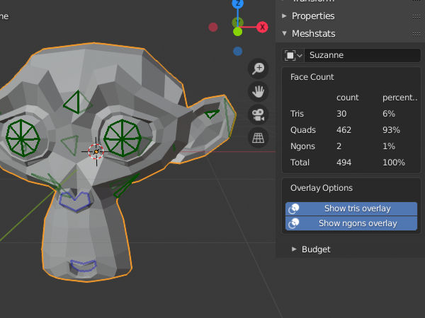

# Changelog

## [Unreleased]

### Added

- TODO: Poles overlay.

### Changed

- TODO: Preferences & defaults.
- TODO: Overlay improvements.

## [0.2] - 2020-02-01

### Added
- Face budgets per mesh.  There are three algorithms for calculating face
  budget utilization.  `Tris` calculates utilization based on the
  triangulation of the mesh.  `Quads Only` disregards tris & ngons and counts
  only quads.  `Faces` counts each tri, quad and ngon as one.
- Customization of colors (with alpha) in overlay.

### Fixed
- Fixed visibility check for ngons.  When face center was not on the surface
  (when vertices are not co-planar) visibility check was always returning
  `False`.  Fix involves projecting the calculated center onto the mesh and
  using that as the ngon center.

## [0.1] - 2020-01-04

### Added
- Display basic face statistics inside `Item -> Meshstats` panel in 3D view.
- Diplay in 3D view and overlay where tris & quads are outlined.
- Allow enabling & disabling the overlay.  This setting is saved with the
  scene.

[Unreleased]: https://github.com/muhuk/meshstats/compare/v0.2...v0.1
[0.2]: https://github.com/muhuk/meshstats/releases/tag/v0.1...HEAD
[0.1]: https://github.com/muhuk/meshstats/releases/tag/v0.1
