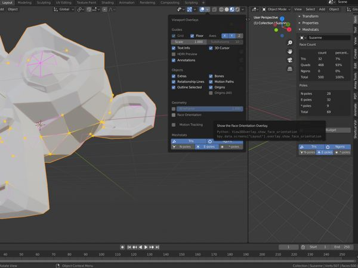

# Changelog

## [1.2] - 2021-06-15

### Added

- Implemented enabling & disabling meshstats per object.
- Added a new preference option to choose whether meshstats is enabled or
  disabled for newly created objects.

### Changed

- Caching is reimplemented.  Time-to-live for cache entries is increased from
  500 milliseconds to 1 minute.  Cached data is updated when geommetry is
  changed (via depsgraph) instead of relying on (very short) TTL to clear
  stale data.
- In addition to other minor tweats in the UI, when polygon count is over
  budget, utilization is displayed with emphasis (alert).

## [1.1] - 2020-12-21

### Added

- Added face count limit to prevent meshstats calculating stats on dense
  meshes.  Default value is `10.000`, this should be okay for most people.  On
  my machine calculating stats on an object with 10k faces takes approximately
  50ms.  You can change this setting in addon preferences.
- Statistic calculations are cached for a short while.

## [1.0] - 2020-11-23

### Changed
- Due to [changes in Blender
  API](https://wiki.blender.org/wiki/Reference/Release_Notes/2.91/Python_API)
  minimum version for this addon is now `2.91`.

### Fixed
- Fixed first draw call using the wrong shader.  See
  [1bb3655](https://github.com/muhuk/meshstats/commit/49bbf831af27992446a459f806a9768bc1bb3655).

## [0.3] - 2020-05-24

### Added

- Display poles in overlay.  You can enable this overlay in `Item ->
  Meshstats` panel in 3D view.
- Display pole statistics (below face statistics).
- Added factory defaults for overlay colors.  Click `Reset Meshstats settings`
  button in addon preferences to return to factory defaults.
- Overlay settings are now also available in overlay pop-over.

### Changed

- Meshstats overlays are only visible if viewport overlays are enabled.
- Overlay colors are configured at addon level, not at scene level.

### Removed

- Changing of overlay colors is removed from 3D view panel.

## [0.2] - 2020-02-01

### Added
- Face budgets per mesh.  There are three algorithms for calculating face
  budget utilization.  `Tris` calculates utilization based on the
  triangulation of the mesh.  `Quads Only` disregards tris & ngons and counts
  only quads.  `Faces` counts each tri, quad and ngon as one.
- Customization of colors (with alpha) in overlay.

### Fixed
- Fixed visibility check for ngons.  When face center was not on the surface
  (when vertices are not co-planar) visibility check was always returning
  `False`.  Fix involves projecting the calculated center onto the mesh and
  using that as the ngon center.

## [0.1] - 2020-01-04

### Added
- Display basic face statistics inside `Item -> Meshstats` panel in 3D view.
- Diplay in 3D view and overlay where tris & quads are outlined.
- Allow enabling & disabling the overlay.  This setting is saved with the
  scene.

[1.2]: https://github.com/muhuk/meshstats/compare/v1.1...v1.2
[1.1]: https://github.com/muhuk/meshstats/compare/v1.0...v1.1
[1.0]: https://github.com/muhuk/meshstats/compare/v0.3...v1.0
[0.3]: https://github.com/muhuk/meshstats/compare/v0.2...v0.3
[0.2]: https://github.com/muhuk/meshstats/compare/v0.1...v0.2
[0.1]: https://github.com/muhuk/meshstats/releases/tag/v0.1
