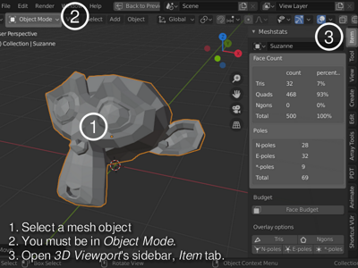
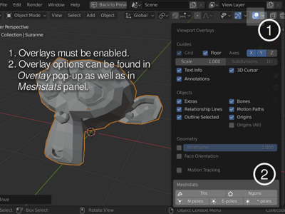

# meshstats

[Blender](https://www.blender.org/) addon that provides mesh statistics.

meshstats is released with [GPL license](./COPYING.txt), same as [Blender](https://www.blender.org/about/license/)

## Features

- Display how many tris, quads & ngons the selected mesh has.
- Draw outlines of tris & ngons in the 3D view.

See [CHANGELOG.md](./CHANGELOG.md) for release details.

## Installation

- Download the source zip [from releases
  page](https://github.com/muhuk/meshstats/releases).  You need to click to
  expand `Assets` under the correct version and download the file named
  `meshstats-#.#.zip` (where #.# is the version number).
- In Blender 2.80 or later, open `Preferences` editor (`Edit -> Preferences`
  from the menu).
- Click `Install...` button and choose the zip file you have downloaded.
- Once the addon is installed, you **must** still enable it manually in
  `Preferences` view.  It is not automatically enabled.
- After installation, you can delete the zip file you have downloaded.

## Usage

Once you have enabled the addon, you should see a `Meshstats` panel under
`Item` tab in 3D view sidebar (default shortcut is `N`).  Note that
`Meshstats` panel is displayed only when the active object is a mesh.

### How to View Face Counts

1. Select a mesh object.
2. You must be in `Object Mode`.
3. Open `3D Viewport's sidebar`, `Item` tab.

### How to Display Tri & Ngon Overlays

1. Overlays must be enabled.
2. Overlay options can be found in `Overlay` pop-up as well as in `Meshstats`
   panel.

### How to Set Up a Face Budget

**TODO**
